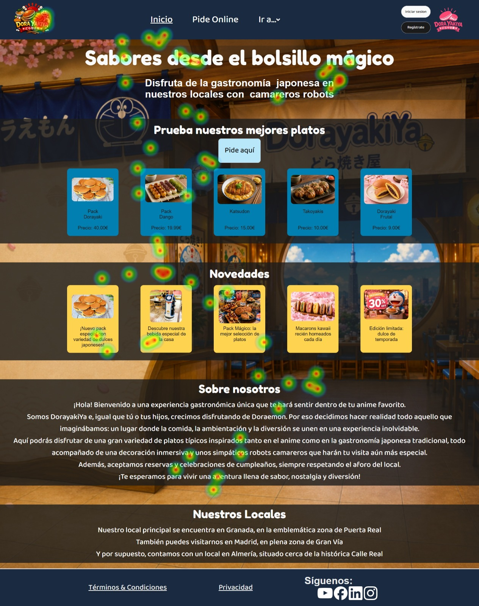
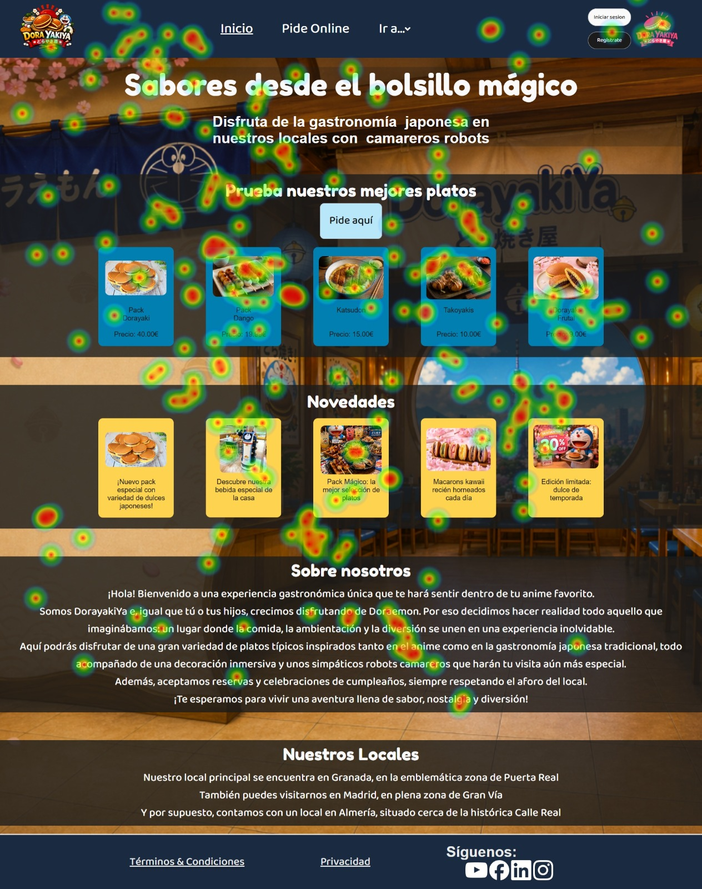
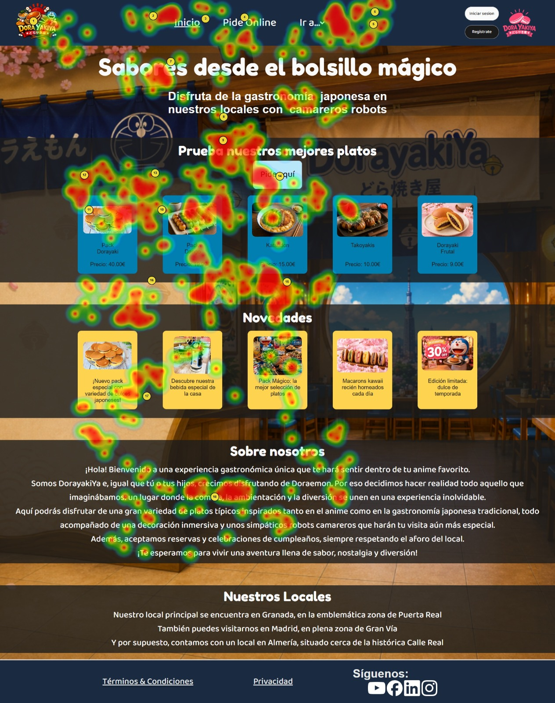
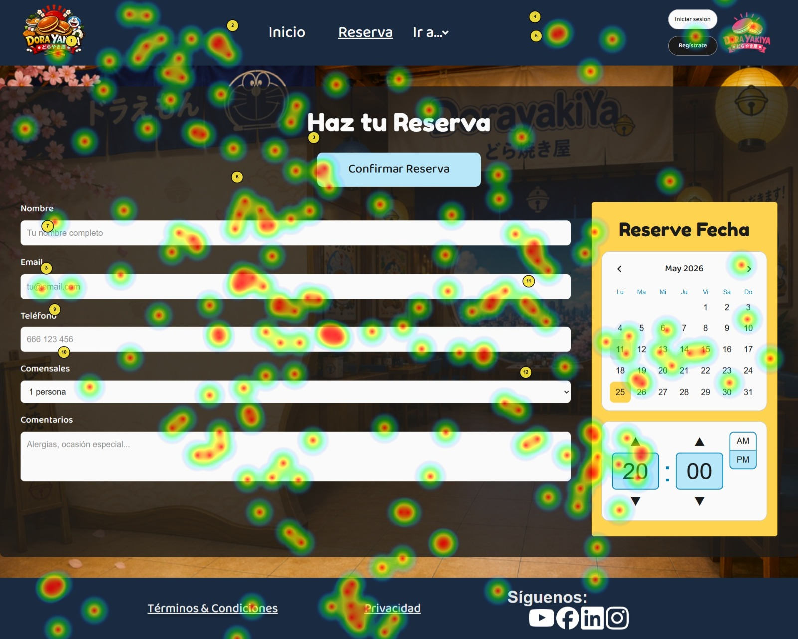
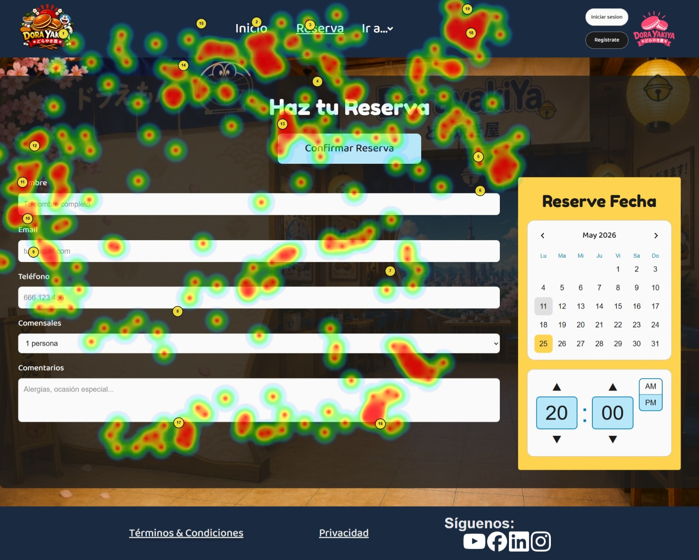
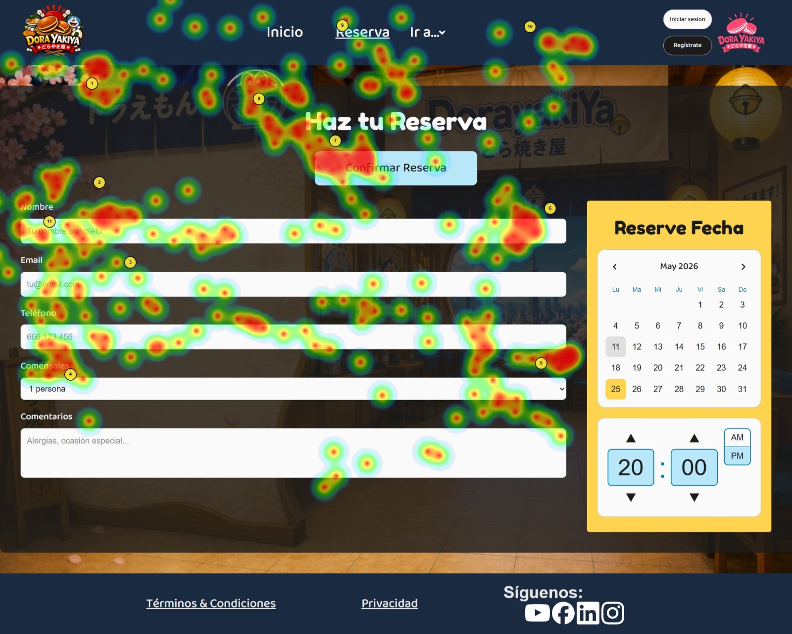

# DIU - Práctica 5: Evaluación · A/B Testing y Accesibilidad

**Proyecto:** SushiJAMA  
**Centro:** ETSIIT — Universidad de Granada  
**Curso:** 2025-2026  
**Equipo:** Manuel Jesús Izquierdo, Juan Antonio Jara

---

## Descripción

En esta práctica evaluamos la usabilidad de dos diseños web mediante un estudio A/B. Nuestra propuesta actúa como **Caso A (SushiJAMA)** y evaluamos como **Caso B** el proyecto **DorayakiYa** del equipo DIU1.Zipizape.

La metodología combina cuatro pilares: reclutamiento de usuarios, Eye Tracking con GazeMapping, cuestionario SUS y auditoría de accesibilidad. Los resultados se sintetizan en un Usability Report centrado en el Caso B.

🔗 **Web evaluada (Caso B):** [https://repair-umber-32369566.figma.site](https://repair-umber-32369566.figma.site)

---

## 1. Reclutamiento de Usuarios y Diseño del Experimento

Se definieron 3 tareas para guiar cada sesión, diseñadas para aislar variables independientes y cubrir los flujos principales de DorayakiYa:

| Tarea | Descripción | Variable que mide |
|---|---|---|
| **T1** | Encuentra el plato más caro del menú | Distinción entre Carta y Pide Online |
| **T2** | Reserva una mesa para 2 personas este sábado a las 21:00 | Flujo de reserva, comprensión AM/PM |
| **T3** | Añade un Katsudon al carrito y ve al proceso de pago | Flujo de compra |

Las sesiones fueron **supervisadas** con duración de 5-10 minutos. El Eye Tracking se registró de forma simultánea durante las tareas.

### Tabla de participantes

| ID | Edad | Género | Nivel Digital | Gafas/Lentillas | Exp. previa | Caso |
|---|---|---|---|---|---|---|
| P01 | 21 | Hombre | Alto | Sí | Sí | B |
| P02 | 21 | Mujer | Medio | Sí | No | B |
| P03 | 20 | Hombre | Alto | No | Sí | B |
| P04 | 21 | Hombre | Alto | No | Sí | B |
| P05 | 22 | N/D | Alto | Sí | No | B |

📋 [Ver tareas de prueba completas](./tareas_prueba.md)

---

## 2. Eye Tracking

Se utilizó **GazeMapping** para analizar el comportamiento visual sobre las páginas Inicio y Reserva con 3 usuarios por página.

### Página Inicio

| Usuario 1 | Usuario 2 | Usuario 3 |
|---|---|---|
|  |  |  |

- ✅ El botón **"Pide aquí"** recibe atención consistente en todos los usuarios
- ✅ Las tarjetas de productos de la primera fila concentran la mayor atención visual
- ⚠️ El menú **"Ir a..."** recibe muy poca atención — los usuarios no lo usan para navegar a Reserva
- ⚠️ La sección Novedades capta atención pero no genera acción (sin CTA asociado)

### Página Reserva

| Usuario 1 | Usuario 2 | Usuario 3 |
|---|---|---|
|  |  |  |

- 🔴 El botón **"Confirmar Reserva"** aparece encima del formulario — los usuarios lo ven antes de rellenar, rompiendo el flujo
- ⚠️ El selector **AM/PM** genera patrones de duda confirmados por los 3 usuarios
- ✅ El calendario recibe atención clara y directa
- ✅ Los campos del formulario siguen un orden de lectura descendente correcto

---

## 3. Cuestionario SUS y Análisis A/B

El SUS se administró **inmediatamente después** de las tareas. Resultados analizados con **sus.mixality.de**.

| Usuario | Puntuación SUS | Etiqueta |
|---|---|---|
| P01 | 70.0 | Good 🟢 |
| P02 | 70.0 | Good 🟢 |
| P03 | 75.0 | Good 🟢 |
| P04 | 77.5 | Good 🟢 |
| P05 | 62.5 | Marginal 🟡 |
| **Media Caso B** | **75.0** | **Good** |

La media de **75/100** supera el umbral de aceptabilidad (68), situándose en la franja **Good**. La **Pregunta 5** (integración de funciones) es el ítem con mayor margen de mejora, con un 60% de respuestas neutras o negativas, apuntando a la confusión entre Carta y Pide Online.

---

## 4. Auditoría de Accesibilidad

| Página | Lighthouse | WAVE AIM |
|---|---|---|
| Inicio | 82/100 | 9.3/10 ✅ |
| Carta | — | 4.0/10 🔴 |
| Pedir Online | — | 5.2/10 🟠 |
| Carrito | — | 9.1/10 ✅ |
| Reseñas | — | 8.1/10 ✅ |

Los errores más graves son los **24 errores de contraste en la página Carta** y la **ausencia de estructura semántica HTML** en toda la web.

📄 [Ver Accessibility Report completo](./Accessibility_Report_Dorayakiya.md)

---

## 5. Usability Report

📄 [Ver Usability Report completo](./P4_UsabReport_Dorayakiya_doneby_DIU1_SushiJAMA.md)

---

## Conclusiones

La evaluación de DorayakiYa ha confirmado que las técnicas de UX Research combinadas aportan más información que cualquiera por separado. El SUS identificó la confusión entre Carta y Pide Online; el Eye Tracking localizó el problema concreto del botón mal posicionado en la Reserva; y la auditoría de accesibilidad reveló que los errores más graves se concentran precisamente en la página más visitada.

El proceso nos ha enseñado que pequeñas decisiones de layout (la posición de un botón respecto a un formulario) tienen un impacto real y medible en la experiencia del usuario, algo que no habría sido evidente sin el apoyo de datos biométricos. La metodología UX aplicada de forma sistemática permite tomar decisiones de diseño con evidencia, no con intuición.
